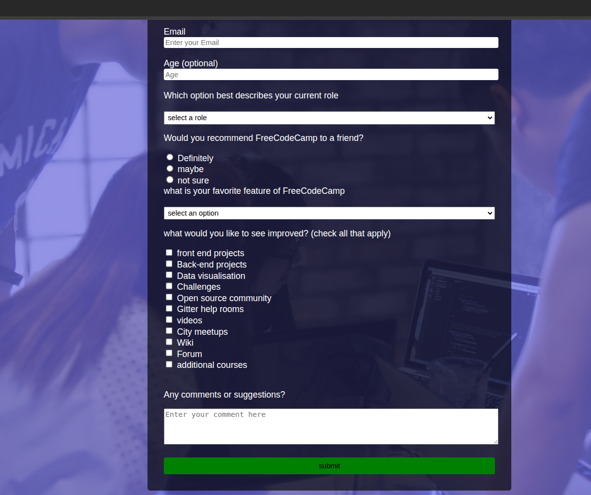

# freeCodeCamp Survey Form
preview

## About
This project is a responsive HTML Survey Form designed to collect user feedback through interactive input fields.
The form includes text fields, radio buttons, checkboxes, dropdowns, and a comment section. All elements are organized using semantic HTML for accessibility and clean structure.
## features
* User Information Section – collects basic details such as name and email

* Survey Questions Section – radio buttons, checkboxes, and dropdown menu

* Comment Section – collects additional feedback

* Submit Button – sends the form for processing or display (no backend required)

## usage
Open the form with any browser of your choice
- Fill in the required fields.

- Select your preferred options.

- Add comments if needed.

- Click Submit to complete the survey.

## Built With

HTML
CSS
* Prerequisites
To work with or modify this project, you should understand:
Basic HTML: tags, forms, inputs
Linking CSS files

Clone Project
To get a local copy on your machine:

Clone the repository using:
[https://github.com/ChiaEndu/Survey-form]

Move into the project directory using:
cd html-survey-form

Command Line Steps
 git clone https: [https://github.com/ChiaEndu/Survey-form]
 cd html-survey-form
 git checkout main

Start App
Since this is an HTML project, simply open the file:
open index.html

Live Site
[https://chiaendu.github.io/Survey-form/]

Author
Chia

GitHub: @ChiaEndu